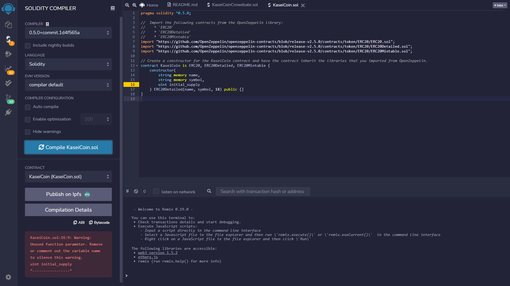
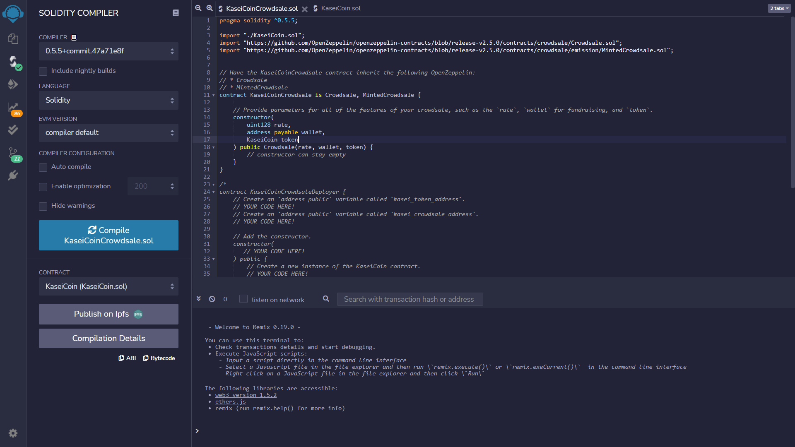
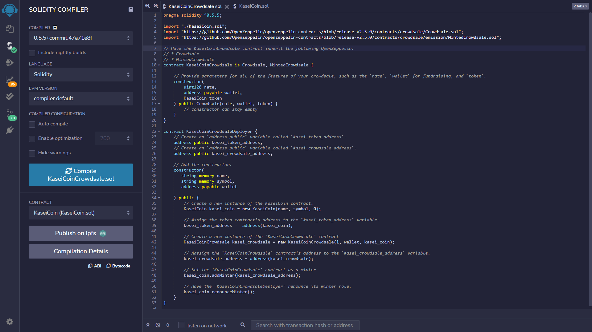
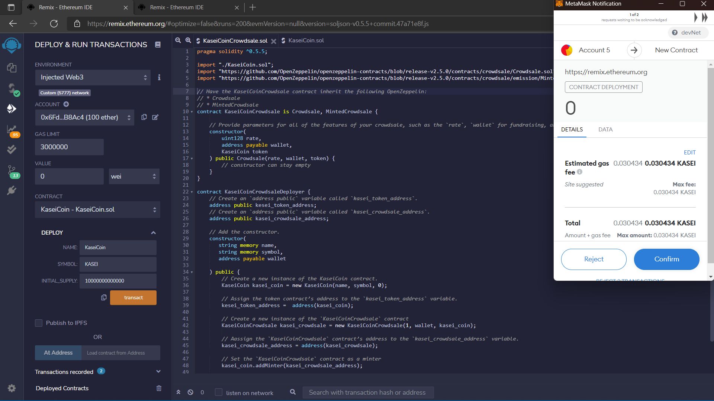
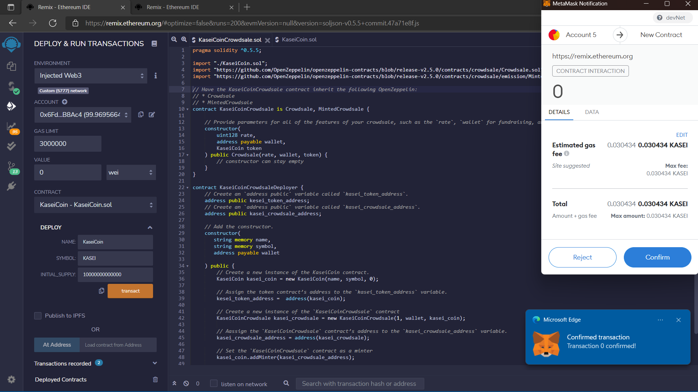
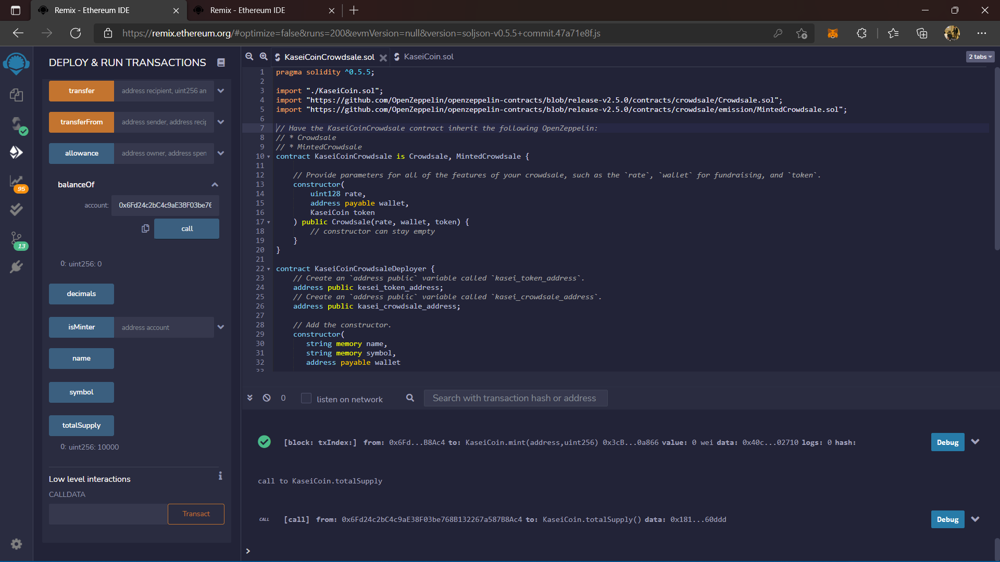

# Kasei Coin Crowdsale

A fungible, ERC-20 compliant token that will be minted by using a `Crowdsale` contract from the OpenZeppelin Solidity library.

## Evaluation Evidence
1. Create the KaseiCoin Token Contract

2. Create the KaseiCoin Crowdsale Contract

3. Create the KaseiCoin Deployer Contract

4. Deploy the Crowdsale to a Local Blockchain

